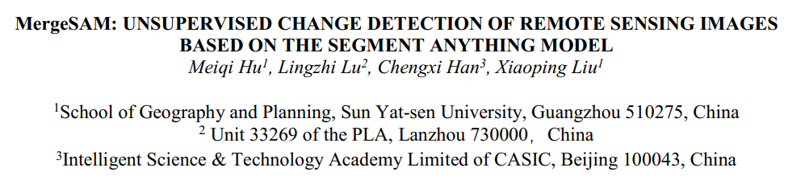
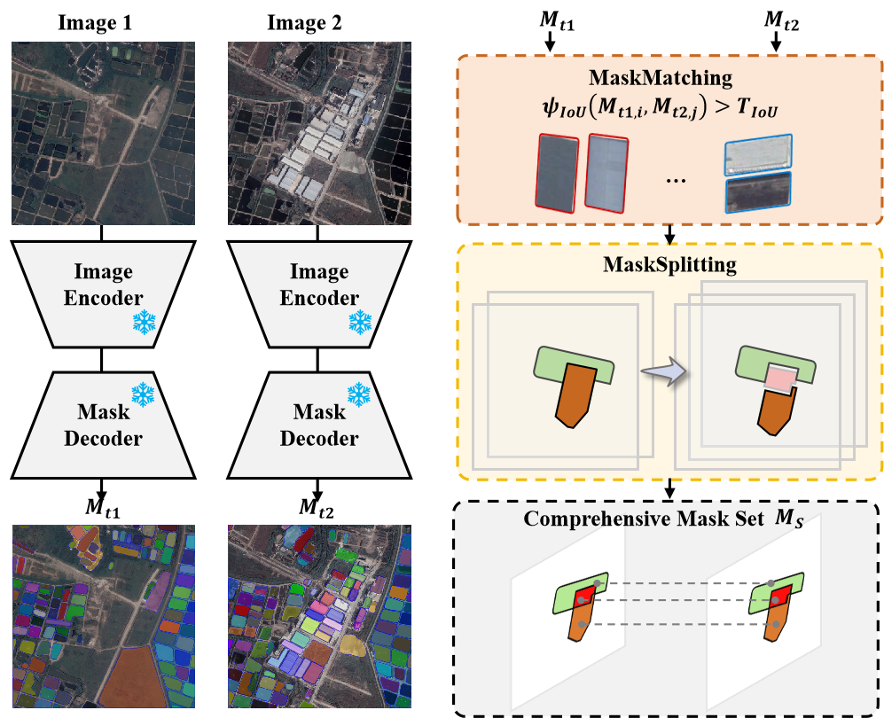
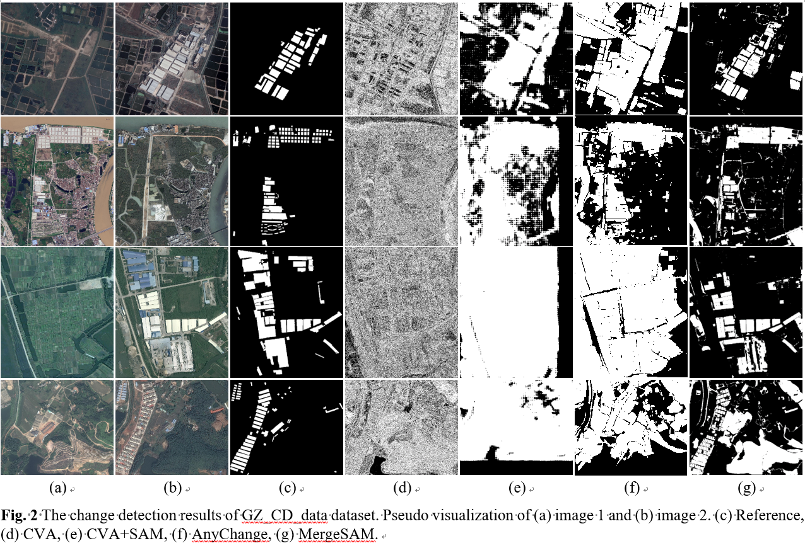

<div align="center">

<h1><a href="https://arxiv.org/abs/2507.22675">MergeSAM: Unsupervised Change Detection of Remote Sensing Images Based on the Segment Anything Model</a></h1>

**IGARSS 2025 | PyTorch Implementation**

<div align="center">
  
</div>
</div>

## ⭐ Share us a star if you find this repo helpful!

**Official PyTorch implementation** of the IGARSS 2025 paper:  
“**MergeSAM: Unsupervised Change Detection of Remote Sensing Images Based on the Segment Anything Model (SAM)**”  
- Paper (arXiv): https://arxiv.org/abs/2507.22675  
- WeChat post: https://mp.weixin.qq.com/s/EBGxqvBYl832S8MyHi9Q5w

---

## 1) 项目简介（Overview）

**Abstract**  
Recently, large foundation models trained on vast datasets have demonstrated exceptional capabilities in feature extraction and general feature representation. The ongoing advancements in deep learning-driven large models have shown great promise in accelerating unsupervised change detection methods, thereby enhancing the practical applicability of change detection technologies. Building on this progress, this paper introduces MergeSAM, an innovative unsupervised change detection method for high-resolution remote sensing imagery, based on the Segment Anything Model (SAM). Two novel strategies, MaskMatching and MaskSplitting, are designed to address real-world complexities such as object splitting, merging, and other intricate changes. The proposed method fully leverages SAM's object segmentation capabilities to construct multitemporal masks that capture complex changes, embedding the spatial structure of land cover into the change detection process.

---

## 2) 论文流程与结果（Figures from the Paper）


<div align="center">
  <br/>
  <em>Fig. 1. MergeSAM pipeline with <strong>MaskMatching</strong> & <strong>MaskSplitting</strong>.</em>
</div>

<div align="center">
  <br/>
  <em>Fig. 2. Qualitative results on high-resolution change detection benchmarks.</em>
</div>

---

## 3) How to Start

> 以下以 `maincode.py` 为例。

### 3.1 安装并引入 SAM 项目
- SAM官方仓库：https://github.com/facebookresearch/segment-anything  
- 在 `maincode.py` **第 7 行**修改为你的本地路径（示例）：
```python
# line 7
SAM_PROJECT_PATH = "/absolute/path/to/segment-anything"
import sys; sys.path.append(SAM_PROJECT_PATH)
````

### 3.2 下载并设置 SAM 预训练权重

* 下载权重文件（示例：`sam_vit_h_4b8939.pth`、`sam_vit_l_0b3195.pth`、`sam_vit_b_01ec64.pth`）。
* 在 `maincode.py` **第 27、29、31 行**将 `sam_checkpoint` 替换为你的权重路径（示例）：

```python
# lines 27 / 29 / 31 (examples)
sam_checkpoint_h = "/absolute/path/to/sam_vit_h_4b8939.pth"
sam_checkpoint_l = "/absolute/path/to/sam_vit_l_0b3195.pth"
sam_checkpoint_b = "/absolute/path/to/sam_vit_b_01ec64.pth"
```

### 3.3 准备数据并设置路径

* 下载 **GZ\_CD\_data** 或其它二值变化检测数据集并解压。
* 在 `maincode.py` **第 146 行**设置数据根目录（示例）：

```python
# line 146
img_root = "/absolute/path/to/GZ_CD_data"
```

* **GZ\_CD\_data（百度网盘）**：[https://pan.baidu.com/s/1TpeUDKIUH3iUXSsEe04YLg?pwd=359n](https://pan.baidu.com/s/1TpeUDKIUH3iUXSsEe04YLg?pwd=359n)
  提取码：**359n**

### 3.4 环境与运行（示例）

* 推荐环境：Python ≥ 3.8、PyTorch ≥ 1.11、CUDA（可选）、opencv-python、numpy、tqdm 等。
* 运行：

```bash
python maincode.py
```

> 注意：若行号不一致，请根据注释语义定位变量（`SAM_PROJECT_PATH`、`sam_checkpoint`、`img_root`）。如需切换 SAM 变体（H/L/B），请确保权重文件与模型配置匹配。

## Acknowledgement
Thanks to the following repository:
[AnyChanger](https://github.com/Z-Zheng/pytorch-change-models/blob/main/torchange/models/segment_any_change/README.md).


